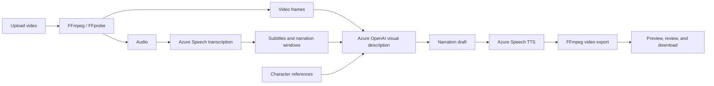

# VisionEcho

**An audio description studio for video.**

**English** · [简体中文](README.zh-CN.md)

VisionEcho turns visual information into spoken descriptions so blind and low-vision audiences can follow actions, characters, and scene changes that dialogue alone does not convey. Creators can upload a video, generate a draft, check it against the original, refine the narration, and export the result in one workspace.

The project is designed for creators, educators, and accessibility teams working on short videos. AI supplies a first draft; visual evidence, character cards, editable subtitles, and version history support human review.

## Core features

| Capability | In the studio |
|---|---|
| Video library | Real thumbnails, project folders, search, status filters, recent edits, archiving, and a recoverable recycle bin. |
| Dialogue subtitles | Mandarin and English recognition with measured word timestamps and speaker IDs. Edit text, timing, and speakers; add or remove subtitle lines; rerun recognition for calibration. |
| Visual description | Draft narration from sampled video frames, scene changes, dialogue context, and established character references. |
| Visual evidence | Inspect each segment’s keyframes and timestamps, seek to the original video, and record incorrect characters, actions, or missing details. |
| Character cards | Extract appearances and frame references, confirm names, check related passages, and set when a name may first be used. Distinctive fictional roles can be named automatically when visual evidence supports the match. |
| Languages and voices | Choose English or Mandarin narration independently of the source dialogue, with three voices per language. |
| Review and revision | Compare original and described playback, filter review tasks, approve or flag segments, inspect timing issues, and create new voiced versions. |
| Focused rewriting | Shorten a segment, make it more objective, or add visible atmosphere details. Rewrites first enter the draft for review. |
| Export | One editor-header menu offers MP4, SRT, VTT, and TXT downloads with format explanations. Approval is optional and does not block saved-file exports. |
| Introduction and preferences | A bilingual introduction includes an audio-description sample and an interactive timing demonstration. Fresh visits to the introduction start in English; manual language switching works. Light/dark themes and reduced-motion controls are available. |

Speaker IDs are voice labels, not verified identities. Different speakers’ overlapping subtitles can be displayed together, but fully overlapping speech remains difficult to transcribe accurately. Subtitle display and export remove sentence punctuation while preserving meaningful apostrophes and numeric formatting; narration punctuation is unchanged.

## Workflow

1. **Prepare:** upload an MP4 and optionally choose or create a project folder.
2. **Generate:** select dialogue language, narration language, voice, and timing mode. Progress appears beside the player.
3. **Review:** compare the original and described versions, check visual evidence and names, and edit subtitles or narration. Revoicing creates a new version.
4. **Export:** open **Export** and choose a format. Downloads use the saved version and exclude unsaved edits.

The player and timeline stay beside the active task. Version selection stays near the title; character resources, renaming, and new-version settings are available through **Project options**. Click the VisionEcho brand to return to the introduction.

### Narration timing modes

| Mode | How narration is inserted | Resulting duration |
|---|---|---|
| Auto | Uses natural dialogue gaps first; switches to extended narration when suitable gaps are unavailable or eligible drafts need more time. | May increase. |
| Natural gaps | Uses available gaps without extending the source. Videos without suitable gaps may produce subtitles only. | Original duration. |
| Extended narration | Pauses the picture at planned insertion points, plays the description, then resumes the source. | Increases by the inserted narration. |

For music-only or ambient videos, select **No dialogue** to skip transcription. Missing audio tracks and detected silence also have explicit skip reasons. Sound without reliably recognized dialogue is not treated as confirmed silence: Auto and Extended modes place supplementary narration after the original audio, while Natural gaps mode preserves the source without inserting narration.

Drafts that cannot fit their narration window are retained with a reason for review; they are not truncated or mixed over dialogue. Unvoiced segments are excluded from the narration track and TXT export.

### Languages and voices

| Setting | Choices |
|---|---|
| Source dialogue | Auto detection between Mandarin and English; Mandarin; English; no dialogue. |
| Mandarin narration | Xiaoxiao, Yunxi, Xiaoyi. |
| English narration | Jenny, Guy, Aria. |

Subtitles remain in the source language. Choosing another narration language does not translate dialogue subtitles. Interface language is a separate setting.

### Export formats

| Format | Contents |
|---|---|
| MP4 | Saved video with original audio and the narration successfully generated for that version. |
| SRT | Dialogue subtitles with timecodes for common players and editing tools. |
| VTT | Dialogue captions with timecodes for web and HTML5 video. |
| TXT | Successfully voiced narration segments with time ranges. |

Subtitles are separate files and are not burned into the MP4. Review labels help with checking; they do not certify accuracy or restrict downloading an existing result.

## Architecture

| Layer | Implementation |
|---|---|
| Frontend | React 19, TypeScript, Vite 8, Fluent UI React, and Tailwind CSS. |
| Backend | Python 3.12 and FastAPI. |
| Visual understanding | A configurable Azure OpenAI multimodal deployment. The example deployment name is `gpt-5.6-terra`; it must match an available deployment in your Azure resource. |
| Dialogue recognition | Azure Speech SDK `ConversationTranscriber` for speaker labels and word timestamps; continuous `SpeechRecognizer` fallback when that SDK capability is unavailable. |
| Narration synthesis | Azure Speech Neural TTS. |
| Media processing | FFmpeg / FFprobe for probing, frame extraction, audio preparation, timing, mixing, and MP4 export. |
| Storage | Media and JSON workspace indexes on the backend machine; SQLite for hosted accounts and sessions. |



## Run locally

Install Python 3.12, Node.js 22 or 24 LTS, and FFmpeg / FFprobe. Generation requires accessible Azure OpenAI and Azure Speech resources.

```bash
git clone https://github.com/lianshuang2023-stack/VisonEcho.git
cd VisonEcho
python3.12 -m venv .venv
.venv/bin/python -m pip install -r local_backend/requirements-dev.txt
npm --prefix dashboard/frontend ci
cp .env.azure.example .env.local
chmod 600 .env.local
```

Set these backend-only values in `.env.local`:

- `AZURE_OPENAI_ENDPOINT`, `AZURE_OPENAI_API_KEY`, and `AZURE_OPENAI_DEPLOYMENT`.
- `AZURE_SPEECH_KEY`, plus `AZURE_SPEECH_ENDPOINT` or `AZURE_SPEECH_REGION`.
- Optional language defaults, media-tool paths, and upload limits from the template.

Start both services:

```bash
./run-local.sh
```

- Website: [http://127.0.0.1:5174/](http://127.0.0.1:5174/)
- API documentation: [http://127.0.0.1:8000/api/docs](http://127.0.0.1:8000/api/docs)

Both services bind to the local machine. See the [local usage guide](RUN-LOCAL.md) for configuration, editing, and troubleshooting.

## Hosted access and privacy

Local mode stores work in the backend’s `.local-data/`. Hosted mode uses separate account or guest workspaces in `HOSTED_DATA_DIR` and does not import the maintainer’s local cases. The introduction and illustrative sample are public; workspace media requires the corresponding session.

Hosted guest trials currently allow up to **5 uploads**, **1 GiB (shown as 1 GB) and 60 seconds per video**, and **5 shared AI operations**. Generation, revoicing, subtitle calibration, character detection, and segment rewriting share that allowance. Guest sessions last 24 hours; registering within a valid guest session preserves that workspace. Account passwords are 12–24 characters.

Original videos and results stay on the backend’s storage. Extracted audio, selected frames, and relevant text are sent to the configured Azure services for AI processing. Credentials are read only by the backend and must not be placed in `VITE_*` variables or committed to Git. Azure services incur usage charges.

See the [access and data-isolation guide](DEPLOYMENT-PRIVACY.md) and [Linux deployment guide](deploy/README.md). The repository includes a Docker/Caddy setup; deployment still requires a configured server, persistent storage, and a suitable HTTPS entry point.

## Current scope and limitations

- Local defaults accept MP4 videos up to 500 MiB and 10 minutes; server configuration can change these limits. Hosted guest limits are separate.
- The backend supports one media-processing task at a time and one application process. It is intended for small-scale use, not a multi-worker production queue.
- Recognition can miss or misattribute noisy, overlapping, or unclear dialogue. Word timing comes from the service; missing reliable timing is not replaced with invented timestamps.
- Frame sampling can miss brief actions. Character matches and descriptions can be wrong; review the source before publishing. Automatic naming covers distinctive fictional roles, not identification of real people from faces.
- Guest expiry prevents further session access but does not automatically delete media. Hosted retention, backups, and overall Azure spending limits require operator configuration.
- Account recovery, email verification, and multi-factor authentication are not implemented.

## Development and verification

| Location | Responsibility |
|---|---|
| `dashboard/frontend/src/components/LandingPage.tsx` | Introduction, public sample, and studio entry. |
| `dashboard/frontend/src/components/LocalVideoWorkspace.tsx` | Library, projects, upload, and recycle bin. |
| `dashboard/frontend/src/components/workspace/` | Studio, evidence, characters, comparison, review, and exports. |
| `local_backend/main.py` | Local API, uploads, task dispatch, and storage. |
| `local_backend/pipeline.py` | Generation pipeline. |
| `local_backend/transcription.py`, `subtitles.py`, `calibration.py` | Recognition, subtitle presentation, and recalibration. |
| `local_backend/review.py`, `rewrite.py` | Segment checks, saved review state, and focused rewrites. |
| `local_backend/characters.py`, `character_detection.py` | Character cards and automatic extraction. |
| `local_backend/revision.py`, `extended.py` | Revoicing and extended-narration rendering. |
| `local_backend/access.py`, `hosted.py` | Hosted identities, sessions, and workspace isolation. |
| `deploy/` | Linux deployment configuration. |

Run these checks from the repository root:

```bash
.venv/bin/python -m pytest local_backend -q
npm --prefix dashboard/frontend test
npm --prefix dashboard/frontend run build
npm --prefix dashboard/frontend run lint
```

The automated suite uses synthetic media and mocked service responses. It checks behavior rather than guaranteeing recognition quality on every video. The separate `local_backend.check_quality_smoke` script makes live Azure calls when explicitly run and incurs usage. Frontend details are in the [frontend guide](dashboard/frontend/FRONTEND.md).

## Documentation

| Guide | English | 简体中文 |
|---|---|---|
| Project overview | [README](README.md) | [项目介绍](README.zh-CN.md) |
| Local use | [Run locally](RUN-LOCAL.md) | [本地运行](RUN-LOCAL.zh-CN.md) |
| Hosted access | [Access and privacy](DEPLOYMENT-PRIVACY.md) | [登录、试用与数据隔离](DEPLOYMENT-PRIVACY.zh-CN.md) |
| Server deployment | [Linux deployment](deploy/README.md) | [Linux 服务器部署](deploy/README.zh-CN.md) |
| Frontend development | [Frontend guide](dashboard/frontend/FRONTEND.md) | [前端开发说明](dashboard/frontend/FRONTEND.zh-CN.md) |
| Contributing | [Contributing](CONTRIBUTING.md) | [参与项目](CONTRIBUTING.zh-CN.md) |
| Community | [Code of conduct](CODE_OF_CONDUCT.md) | [协作约定](CODE_OF_CONDUCT.zh-CN.md) |
| Demo provenance | [Sample source](dashboard/frontend/public/assets/landing/SOURCE.md) | [示例来源](dashboard/frontend/public/assets/landing/SOURCE.zh-CN.md) |

## License

[MIT-0](LICENSE). See [NOTICE](NOTICE) for the repository’s notices.
