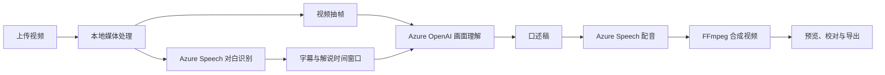

# VisionEcho

**口述电影制作工作台**

VisionEcho 将视频中的画面信息转为口述解说，帮助视障和低视力观众理解人物动作、场景变化与重要视觉细节。创作者可以在一个工作区完成上传、生成、校对、配音和导出。

## 核心功能

- **我的作品**：视频缩略图、项目分类、搜索、状态筛选与最近编辑排序。
- **对白字幕**：自动识别普通话与英语，使用词级时间戳生成字幕，支持文字和时间校准。
- **画面解说**：结合镜头切换、多张视频帧和对白上下文生成口述稿，并记录对应画面依据。
- **画面核对**：逐段查看关键帧与时间点，跳转原片，保存人物、动作和遗漏问题。
- **人物卡**：自动提取外观、画面和出现段落；明显的影视、动画角色可自动命名并用于解说，其他人物按外观区分。
- **中英文配音**：解说语言独立于原片对白语言，每种语言提供三种音色。
- **版本制作**：修改口述稿或音色后重新配音，保留原片、历史版本和已保存字幕。
- **管理与导出**：项目整理、视频归档、可恢复删除，以及 MP4、SRT、VTT 和 TXT 导出。
- **界面偏好**：中文 / English 与亮色 / 暗色切换。

## 制作流程

1. 上传 MP4，选择所属项目或暂不分类。
2. 设置原片对白语言、解说语言、音色与口述方式。
3. 生成字幕、画面解说和配音，查看处理进度。
4. 对照原片校对字幕与口述稿，按需生成新版本。
5. 导出口述视频、对白字幕和解说稿。

### 三种口述方式

| 模式 | 插入方式 | 视频时长 |
|---|---|---|
| 自动 | 优先使用自然对白间隙；没有足够间隙时切换扩展口述 | 视处理结果而定 |
| 自然间隙 | 仅在无对白的时间窗口插入解说；没有合适窗口时可能只生成字幕 | 保持原时长 |
| 扩展口述 | 在对白边界暂停画面，播放解说后继续 | 增加解说播放时间 |

### 语言与音色

| 设置 | 选项 |
|---|---|
| 原片对白语言 | 自动识别、中文普通话、英语 |
| 中文解说音色 | 晓晓、云希、晓伊 |
| 英文解说音色 | Jenny、Guy、Aria |

对白字幕保留原声语言；解说可以另选中文或英文。页面语言切换只影响界面。

## 技术方案

| 层级 | 实现 |
|---|---|
| 前端 | React 19、TypeScript、Vite、Tailwind CSS |
| 后端 | Python 3.12、FastAPI |
| 画面理解与口述稿 | Azure OpenAI 多模态部署，默认部署名为 `gpt-5.6-terra` |
| 对白识别 | Azure Speech SDK 连续识别、语言检测与词级时间戳 |
| 解说配音 | Azure Speech Neural TTS |
| 媒体处理 | FFmpeg / FFprobe：探测、抽帧、音频处理、混音与导出 |
| 数据保存 | 本地文件与 JSON 索引，按作品和生成版本保存 |



原始视频、编辑和生成版本保存在当前设备。处理时，提取的音频与画面会发送至已配置的 Azure 服务；密钥仅由后端读取。

## 本地启动

准备 Python 3.12、Node.js 22 / 24 LTS、FFmpeg / FFprobe，以及可用的 Azure OpenAI 和 Azure Speech 资源。

```bash
git clone https://github.com/lianshuang2023-stack/VisonEcho.git
cd VisonEcho
python3.12 -m venv .venv
.venv/bin/python -m pip install -r local_backend/requirements-dev.txt
npm --prefix dashboard/frontend ci
cp .env.azure.example .env.local
chmod 600 .env.local
```

在 `.env.local` 中填写后端配置：

- `AZURE_OPENAI_ENDPOINT`、`AZURE_OPENAI_API_KEY`、`AZURE_OPENAI_DEPLOYMENT`。
- `AZURE_SPEECH_KEY`，以及 `AZURE_SPEECH_ENDPOINT` 或 `AZURE_SPEECH_REGION`。
- 根据需要调整默认语言、音色与上传限制。

完成后启动：

```bash
./run-local.sh
```

- 工作台：[http://127.0.0.1:5174/](http://127.0.0.1:5174/)
- API 文档：[http://127.0.0.1:8000/api/docs](http://127.0.0.1:8000/api/docs)

服务仅监听本机。详细配置与操作见[本地运行说明](RUN-LOCAL.zh-CN.md)。

托管模式支持登录或免注册试用，各自作品独立，现有本机案例不导入线上。部署步骤与边界见[登录、试用与数据隔离](DEPLOYMENT-PRIVACY.zh-CN.md)。

## 代码导航

| 路径 | 职责 |
|---|---|
| `dashboard/frontend/src/components/LocalVideoWorkspace.tsx` | 作品首页、项目管理与回收站 |
| `dashboard/frontend/src/components/workspace/` | 制作编辑器、对比预览与时间轴 |
| `local_backend/main.py` | API、上传、任务调度与本地存储 |
| `local_backend/pipeline.py` | 视频生成流程 |
| `local_backend/transcription.py` | 对白识别与字幕排版 |
| `local_backend/calibration.py` | 字幕重新校准 |
| `local_backend/revision.py`、`local_backend/extended.py` | 版本重配音与扩展口述导出 |
| `run-local.sh` | 启动本地前后端 |

前端结构详见[开发说明](dashboard/frontend/FRONTEND.md)。

## 验证

```bash
.venv/bin/python -m pytest local_backend -q
npm --prefix dashboard/frontend run build
cd dashboard/frontend
./node_modules/.bin/vitest run
```

## 使用范围

默认支持不超过 500 MB、10 分钟的 MP4，一次处理一个生成或校准任务。字幕为独立文件，未烧录进视频。生成内容需结合原片校对，当前已知问题见[运行说明](RUN-LOCAL.zh-CN.md#当前已知限制)。Azure 服务按实际用量计费。

## 许可证

[MIT-0](LICENSE)
