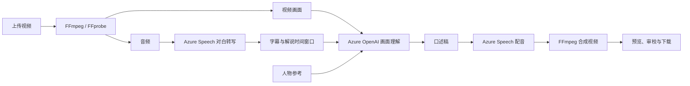

# VisionEcho

**口述电影制作工作台。**

[English](README.md) · **简体中文**

VisionEcho 将画面信息转为口述解说，帮助视障和低视力观众理解对白没有表达的人物动作、角色与场景变化。创作者可以在一个工作区完成上传、生成初稿、对照原片校对、调整配音和导出。

项目面向制作短视频的创作者、教育者和无障碍制作团队。AI 提供初稿，画面依据、人物卡、可编辑字幕和版本历史帮助用户完成后续审校。

## 核心功能

| 能力 | 工作台中的操作 |
|---|---|
| 作品管理 | 真实视频缩略图、项目分类、搜索、制作状态筛选、最近编辑排序、归档和可恢复回收站。 |
| 对白字幕 | 识别普通话和英语，保留实际词级时间戳与说话人编号；编辑文字、时间和说话人，新增或删除字幕行，重新识别并校准。 |
| 画面解说 | 根据抽样视频帧、镜头变化、对白上下文和已有角色信息生成口述稿。 |
| 画面依据 | 查看每段关键帧与时间点，跳转原片，记录人物有误、动作有误或内容遗漏。 |
| 人物卡 | 提取外观和画面引用，确认称呼，检查相关段落，设置姓名最早使用时间；具有充分画面依据的标志性虚构角色可自动命名。 |
| 语言与音色 | 原片对白语言与解说语言独立选择，中文和英文解说各有三种音色。 |
| 审校与版本 | 对比原声与口述版，筛选审校任务，逐段批准或标记问题，检查时长冲突，生成新的配音版本。 |
| 定向改写 | 缩短段落、改为客观描述或补充可见氛围细节；改写先进入草稿，供用户核对。 |
| 导出 | 编辑器顶部保留一个导出菜单，提供 MP4、SRT、VTT、TXT 及格式说明；审校是可选步骤，不限制下载已保存文件。 |
| 介绍与界面偏好 | 中英文介绍页包含口述示例与交互时间轴；新打开介绍页默认英文，可手动切换。支持亮暗主题与减少动态效果。 |

说话人编号是声音标签，不代表已核实的真实身份。不同说话人的重叠字幕可以同时显示，但声音完全重叠时仍可能漏识别或误归类。字幕预览和导出移除句子标点，同时保留有意义的英文撇号及数字格式；口述稿标点不受影响。

## 制作流程

1. 准备素材：上传 MP4，可选择已有项目、新建项目或暂不分类。
2. AI 生成：选择对白语言、解说语言、音色和时间处理方式；播放器旁显示生成进度。
3. 人工审校：对比原片与口述版，检查画面依据和人物称呼，编辑字幕或口述稿；重新配音会创建新版本。
4. 导出：点击“导出”并选择格式。下载使用已保存版本，不包含当前未保存的修改。

视频与时间轴位于当前任务旁。标题附近保留版本选择，人物资源、重命名和新版本设置收进“项目选项”。点击 VisionEcho 品牌可返回介绍页。

### 三种口述方式

| 模式 | 插入方式 | 成片时长 |
|---|---|---|
| 自动 | 优先使用自然对白间隙；没有合适间隙或符合条件的稿件需要更多时间时，切换扩展口述。 | 可能增加。 |
| 自然间隙 | 仅使用已有间隙，不延长原片；没有合适间隙时可能只生成字幕。 | 保持原时长。 |
| 扩展口述 | 在规划的插入点暂停画面，播完解说后继续原片。 | 增加插入的解说时长。 |

只有音乐或环境音的视频可选择“无对白”跳过转写。无音轨或检测到静音时，也会记录明确的跳过原因。有声音但未识别到可靠对白时，系统不会直接认定为静音：自动和扩展模式在原声音频结束后补充解说，自然间隙模式则保留原片、不插入口述。

无法放入口述窗口的长稿会保留并显示原因，供后续校对，不会截断文字或覆盖对白。未成功配音的段落不会加入解说音轨或 TXT 导出。

### 语言与音色

| 设置 | 选项 |
|---|---|
| 原片对白语言 | 自动识别普通话 / 英语、中文普通话、英语、无对白。 |
| 中文解说音色 | 晓晓、云希、晓伊。 |
| 英文解说音色 | Jenny、Guy、Aria。 |

对白字幕保留原声语言。切换解说语言不会翻译对白字幕；页面语言是独立设置。

### 导出格式

| 格式 | 内容 |
|---|---|
| MP4 | 已保存视频，包含原声和此版本成功生成的口述配音。 |
| SRT | 带时间码的对白字幕，适用于常见播放器与剪辑工具。 |
| VTT | 带时间码的对白字幕，适用于网页与 HTML5 视频。 |
| TXT | 成功配音的口述段落，包含时间范围。 |

字幕是独立文件，不会烧录进 MP4。审校标签辅助检查，不代表准确性认证，也不限制下载已有结果。

## 技术架构

| 层级 | 实现 |
|---|---|
| 前端 | React 19、TypeScript、Vite 8、Fluent UI React、Tailwind CSS。 |
| 后端 | Python 3.12、FastAPI。 |
| 画面理解 | 可配置的 Azure OpenAI 多模态部署。示例部署名为 `gpt-5.6-terra`，需与用户 Azure 资源中实际可用的部署名称一致。 |
| 对白识别 | Azure Speech SDK `ConversationTranscriber` 提供说话人标签与词级时间戳；SDK 不提供该能力时回退至连续 `SpeechRecognizer`。 |
| 解说配音 | Azure Speech Neural TTS。 |
| 媒体处理 | FFmpeg / FFprobe，完成探测、抽帧、音频准备、时间调整、混音与 MP4 导出。 |
| 数据保存 | 媒体与 JSON 工作区索引保存在后端所在设备；托管账号和会话使用 SQLite。 |



## 本地启动

准备 Python 3.12、Node.js 22 或 24 LTS、FFmpeg / FFprobe。生成需要可访问的 Azure OpenAI 和 Azure Speech 资源。

```bash
git clone https://github.com/lianshuang2023-stack/VisonEcho.git
cd VisonEcho
python3.12 -m venv .venv
.venv/bin/python -m pip install -r local_backend/requirements-dev.txt
npm --prefix dashboard/frontend ci
cp .env.azure.example .env.local
chmod 600 .env.local
```

在 `.env.local` 填写仅供后端使用的配置：

- `AZURE_OPENAI_ENDPOINT`、`AZURE_OPENAI_API_KEY`、`AZURE_OPENAI_DEPLOYMENT`。
- `AZURE_SPEECH_KEY`，以及 `AZURE_SPEECH_ENDPOINT` 或 `AZURE_SPEECH_REGION`。
- 可按模板调整默认语言、媒体工具路径及上传限制。

启动两个服务：

```bash
./run-local.sh
```

- 网页：[http://127.0.0.1:5174/](http://127.0.0.1:5174/)
- API 文档：[http://127.0.0.1:8000/api/docs](http://127.0.0.1:8000/api/docs)

服务仅监听本机。配置、编辑方法与排错见[本地运行说明](RUN-LOCAL.zh-CN.md)。

## 托管访问与隐私

本地模式将作品保存在后端的 `.local-data/`。托管模式在 `HOSTED_DATA_DIR` 内为账号和访客分别建立工作区，不导入维护者的本机案例。介绍页与演示素材公开可见，工作区媒体需要对应会话才能访问。

托管访客当前支持最多 **5 次上传**，每个视频不超过 **1 GiB（界面显示为 1 GB）、60 秒**，共用 **5 次 AI 处理额度**。生成、重新配音、字幕校准、人物识别和段落改写共享额度。访客会话有效 24 小时，在有效会话内注册可保留当前作品。账号密码长度为 12–24 个字符。

原片与结果保存在后端存储中；提取的音频、选定画面和相关文本会发送至已配置的 Azure 服务进行 AI 处理。凭据仅由后端读取，不应放入 `VITE_*` 变量或提交至 Git。Azure 服务按实际用量计费。

上线请参考[登录、试用与数据隔离](DEPLOYMENT-PRIVACY.zh-CN.md)和[Linux 服务器部署](deploy/README.zh-CN.md)。仓库提供 Docker / Caddy 配置，但仍需实际配置服务器、持久化存储和合适的 HTTPS 入口。

## 当前范围与限制

- 本地默认接受不超过 500 MiB、10 分钟的 MP4，可通过服务端配置调整；托管访客使用独立限制。
- 后端一次只运行一个媒体处理任务，且仅支持单应用进程，适合小规模使用，尚不是多工作进程的生产任务队列。
- 噪声、重叠说话或发音不清可能造成字幕遗漏和说话人误归类。词级时间来自识别服务，缺少可靠时间时不会编造时间戳。
- 抽帧可能漏掉短暂动作，人物匹配和画面描述也可能有误，发布前应结合原片审校。自动命名针对具有明确视觉特征的虚构角色，不从面孔识别真实人物身份。
- 访客会话到期后无法继续访问，但媒体不会自动删除。托管数据保留周期、备份与 Azure 总预算限制需由维护者配置。
- 暂未实现账号找回、邮箱验证和多因素登录。

## 开发与验证

| 路径 | 职责 |
|---|---|
| `dashboard/frontend/src/components/LandingPage.tsx` | 介绍页、公开示例与工作区入口。 |
| `dashboard/frontend/src/components/LocalVideoWorkspace.tsx` | 作品、项目、上传与回收站。 |
| `dashboard/frontend/src/components/workspace/` | 编辑器、画面依据、人物、对比、审校和导出。 |
| `local_backend/main.py` | 本地 API、上传、任务调度与存储。 |
| `local_backend/pipeline.py` | 视频生成流程。 |
| `local_backend/transcription.py`、`subtitles.py`、`calibration.py` | 识别、字幕显示处理与重新校准。 |
| `local_backend/review.py`、`rewrite.py` | 逐段检查、已保存审校状态与定向改写。 |
| `local_backend/characters.py`、`character_detection.py` | 人物卡与自动提取。 |
| `local_backend/revision.py`、`extended.py` | 重新配音与扩展口述合成。 |
| `local_backend/access.py`、`hosted.py` | 托管身份、会话与工作区隔离。 |
| `deploy/` | Linux 部署配置。 |

在仓库根目录执行以下检查：

```bash
.venv/bin/python -m pytest local_backend -q
npm --prefix dashboard/frontend test
npm --prefix dashboard/frontend run build
npm --prefix dashboard/frontend run lint
```

自动测试使用合成媒体与模拟服务响应，验证功能行为，不保证每个实际视频的识别质量。独立的 `local_backend.check_quality_smoke` 脚本在显式运行时会调用真实 Azure 服务并产生用量。前端细节见[前端开发说明](dashboard/frontend/FRONTEND.zh-CN.md)。

## 文档导航

| 文档 | English | 简体中文 |
|---|---|---|
| 项目介绍 | [README](README.md) | [项目介绍](README.zh-CN.md) |
| 本地使用 | [Run locally](RUN-LOCAL.md) | [本地运行](RUN-LOCAL.zh-CN.md) |
| 托管访问 | [Access and privacy](DEPLOYMENT-PRIVACY.md) | [登录、试用与数据隔离](DEPLOYMENT-PRIVACY.zh-CN.md) |
| 服务器部署 | [Linux deployment](deploy/README.md) | [Linux 服务器部署](deploy/README.zh-CN.md) |
| 前端开发 | [Frontend guide](dashboard/frontend/FRONTEND.md) | [前端开发说明](dashboard/frontend/FRONTEND.zh-CN.md) |
| 参与项目 | [Contributing](CONTRIBUTING.md) | [参与项目](CONTRIBUTING.zh-CN.md) |
| 协作约定 | [Code of conduct](CODE_OF_CONDUCT.md) | [协作约定](CODE_OF_CONDUCT.zh-CN.md) |
| 示例来源 | [Sample source](dashboard/frontend/public/assets/landing/SOURCE.md) | [示例来源](dashboard/frontend/public/assets/landing/SOURCE.zh-CN.md) |

## 许可证

[MIT-0](LICENSE)。仓库声明见 [NOTICE](NOTICE)。
